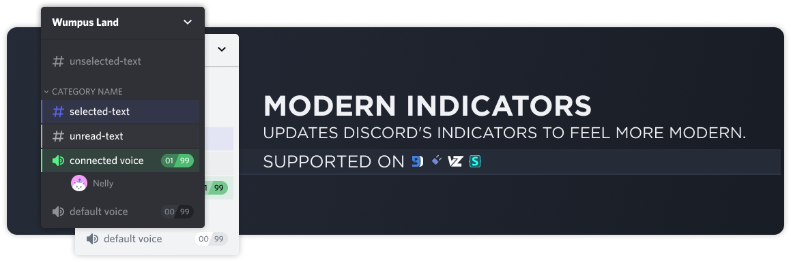
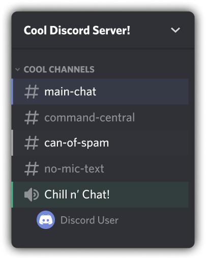

# Modern Channel Indicators
Adds a nice touch to Discord's current channel indicators.



## Installation
For **[Powercord](http://powercord.dev/)** or **[Vizality](https://vizality.com/)** installation, go to **Themes -> Open a CMD / Powershell / Terminal / Gitbash** in the folder, and enter the following:
```
git clone https://github.com/Discord-Theme-Addons/modern-channel-indicators
```

**For BetterDiscord:**
- [Direct Download](https://github.com/Discord-Theme-Addons/modern-channel-indicators/releases/download/1.2.0/ModernChannelIndicators.theme.css)
- [View Source](https://discord-theme-addons.github.io/modern-channel-indicators/src/support/compiled.css)

**For Browser / Web:**
1. Install the Stylus extension for [Chrome](https://chrome.google.com/webstore/detail/stylus/clngdbkpkpeebahjckkjfobafhncgmne) / [Firefox](https://addons.mozilla.org/en-US/firefox/addon/styl-us/) / [Opera](https://github.com/openstyles/stylus/wiki/Opera,-Outdated-Stylus).
2. After installing, head over to [this link](https://discord-theme-addons.github.io/modern-channel-indicators/src/support/ModernChannelIndiactors.user.css).
3. Press the "Install Style" button.

## Customization
In order to change colors, all you have to mess with is `indicator-hovered, indicator-selected, indicator-unread` and `indicator-connected` inside of the root. These values are done in RGB (red, green, blue), so you can just use a simple [color picker](https://www.google.com/search?q=color+picker) off of Google.
